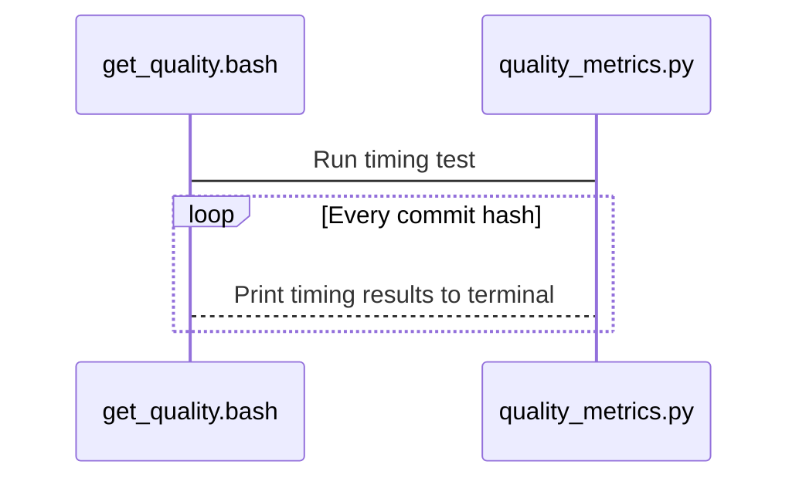

# flasc_metrics
Performance and test coverage metrics for FLASC
(Adapted directly from https://github.com/rafmudaf/floris_metrics)

## Structure

This tool consists of a bash script and a Python script. The bash script lists all
of the commits to include in the timing results and executes the Python script.
The Python script defines a set of FLASC cases, creates the input data, and
prints the timing results.



## How to use

Add more data points by listing new commits to the bottom of the list in the
bash script. Then, run the bash script with this command from the parent
directory of both FLORIS and FLORIS_Metrics:

```
>> $ ls
floris/           floris_metrics/
>> $ bash floris_metrics/get_quality.bash
```

